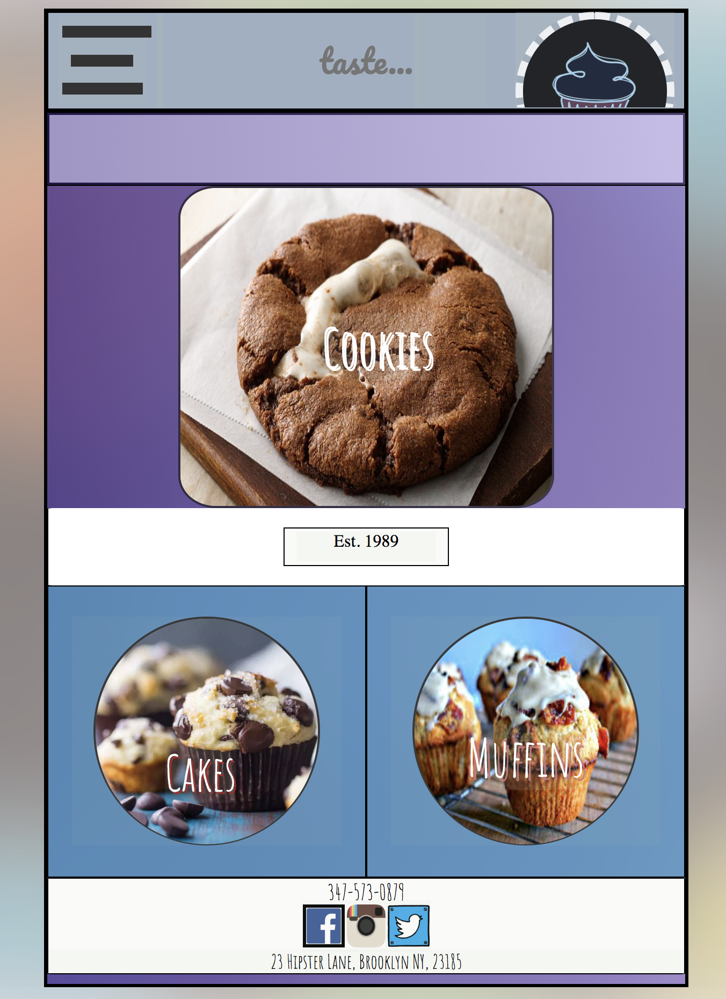

<h3> TASTE - NYCDA Web Dev Fellowship Class Project </h3>

TASTE is a fictional bakery where a hypothetical customer can browse a catalog of baked goods.

<h3> Class project prompt </h3>

Create a fullstack simple blog website that enables someone to sign up for an account and create relevant posts on a topic of their choosing.

<h3> Built with: </h3>

<li> Ruby/Sinatra </li>

<h3> Skills utilized: </h3>

